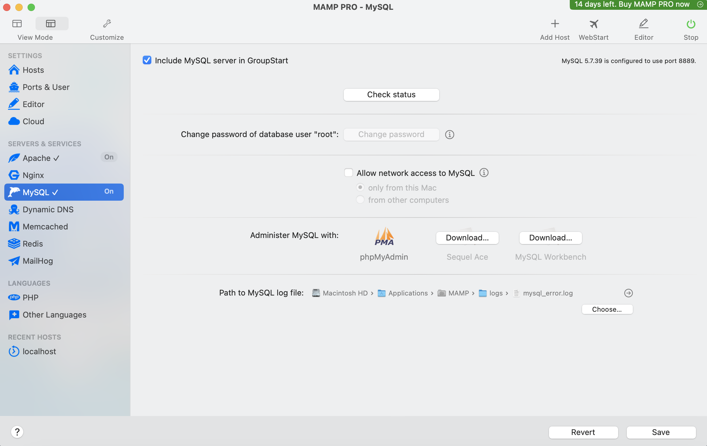
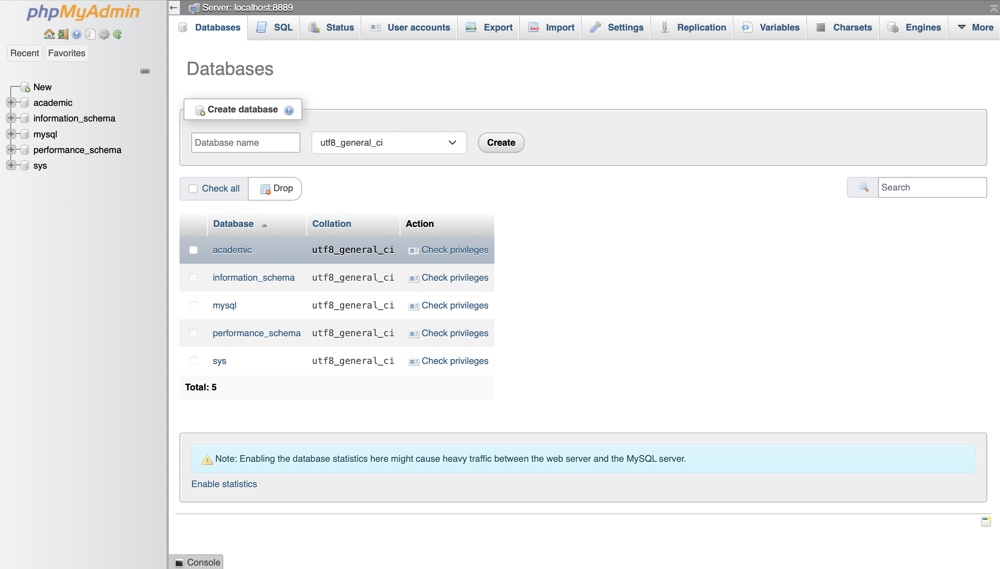
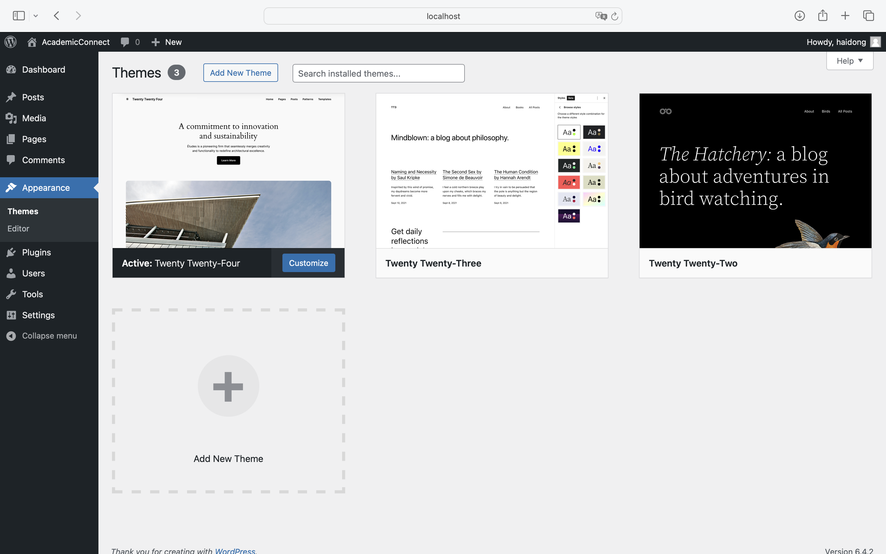

# Week 4 Learning Journal
## Learning Activities & Resources
This week's objective was to demonstrate a dynamic website with a database, either through a CMS or directly using code and a database, running on my localhost.  I accomplished this by installing NAMP (Network Apache MySQL PHP), which allowed me to set up a local hosting environment. The steps I took included:
Installing NAMP: This provided the necessary tools to run an Apache server and a local database on my system.
Configuring WordPress on NAMP: I installed WordPress, ensuring it was configured to work with the local database provided by NAMP.
Transplant the Site: Utilizing my skills from previous weeks, I created a dynamic WordPress site. This included customizing themes, adding content, and ensuring the site was interactive and user-friendly.

https://kinsta.com/blog/install-wordpress-locally/#how-to-install-wordpress-locally-on-mac-using-mamp
https://codex.wordpress.org/Installing_WordPress_Locally_on_Your_Mac_With_MAMP
https://skillcrush.com/blog/install-wordpress-mac/
## Estimated Hours
The entire process, including setting up the database in MAMP, integrating it with my WordPress site, and testing the functionality, took around 5 hours. Additional time was spent on learning and revising SQL concepts, which accounted for approximately 2 hours.
## Content Insights
This week's task deepened my understanding of the technical aspects of web development, particularly in setting up a local hosting environment. I learned the intricacies of configuring WordPress to work with a local database, which is a critical skill for testing and developing websites in a controlled environment. This experience also improved my problem-solving abilities, especially when troubleshooting issues related to local server configuration and database connectivity.
## Career/Employability/Learning Insights 
The ability to set up a local development environment is a valuable skill in the field of web development. It enables developers to test and refine websites before deploying them to a live server, ensuring a higher quality and more reliable final product. This week's activities also highlighted the importance of technical adaptability and the ability to quickly learn and apply new technologies, which are essential qualities in the ever-evolving tech industry. My experience this week has further solidified my foundation in web development and has prepared me for more complex development tasks in the future.
## Screenshots

