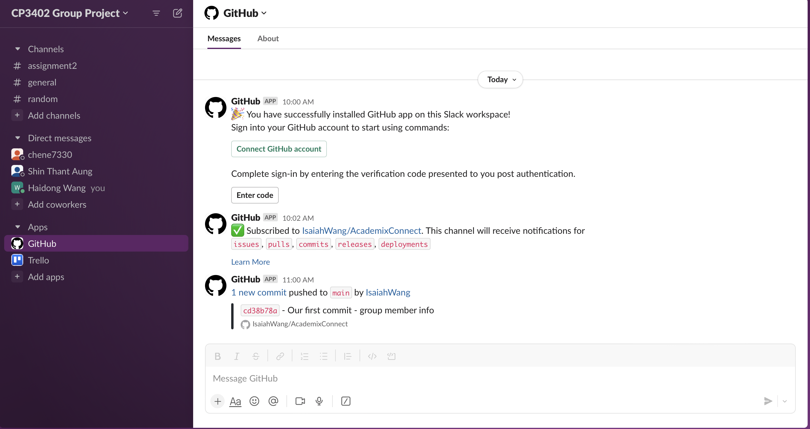
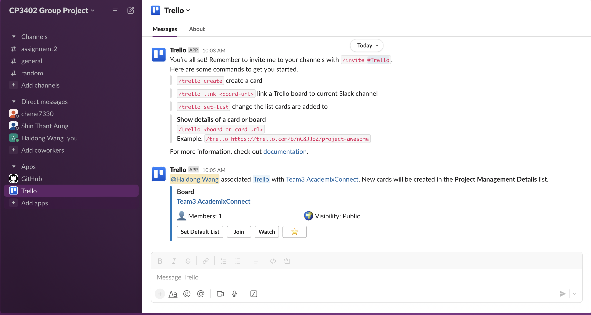

# Week 6 Learning Journal
## Learning Activities & Resources
This week's objective was to set up teamwork tools and start project planning with my group. I accomplished the whole setup of Slack, GitHub, and Trello, and making my first GitHub commit all by myself. I also contributed to the planning for our project and completed the Group Agreement & Contacts in our Trello board. Additionally, I started doing some project planning, including assigning team members to tasks on our Trello board.

https://github.com/CP3402/subject/wiki/Calendar#prac-6---group-setup

https://github.com/ITatJCU/ProjectManagement/wiki

## Estimated Hours
The entire process of setting up the teamwork tools and starting project planning took around 2 hours. Additional time was spent on learning how to integrate GitHub and Trello with our Slack group, which accounted for approximately 1 hour.

## Content Insights
This week's task highlighted the importance of effective communication and collaboration in project planning. The use of teamwork tools such as Slack, GitHub, and Trello has made it easier for our group to stay organized and on track with our project goals. Additionally, the integration of these tools with our Slack group has made it easier for us to stay up-to-date with each other's progress and to collaborate more effectively.
## Career/Employability/Learning Insights 
The ability to effectively use teamwork tools is a valuable skill in the field of web development. It enables developers to work more efficiently and collaboratively, resulting in higher quality and more reliable final products. This week's activities also highlighted the importance of effective communication and collaboration skills, which are essential qualities in any team-based project. My experience this week has further solidified my foundation in project planning and has prepared me for more complex development tasks in the future.
## Links & Screenshots
**Slack**: https://app.slack.com/client/T06B9L7KLUA/C06B9L7LDH8

**Trello**: https://trello.com/b/M3w6nhDg/team3-academixconnect

**Github Repo**: https://github.com/IsaiahWang/AcademixConnect

